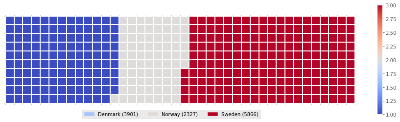

# Waffle_Charts_in_Python

 

A `waffle chart` is an interesting visualization that is normally created to display progress toward goals. It is commonly an effective option when you are trying to add interesting visualization features to a visual that consists mainly of cells, such as an Excel dashboard.

Unfortunately, unlike `R`, `waffle charts` are not built into any of the `Python` visualization libraries. Therefore, we will learn how to create them from scratch.

### Thanks for Reading!
